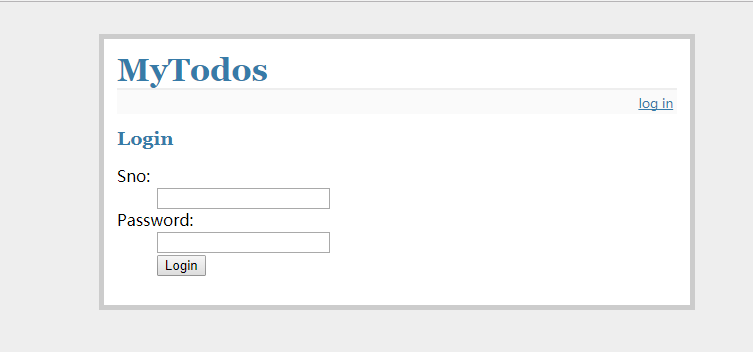
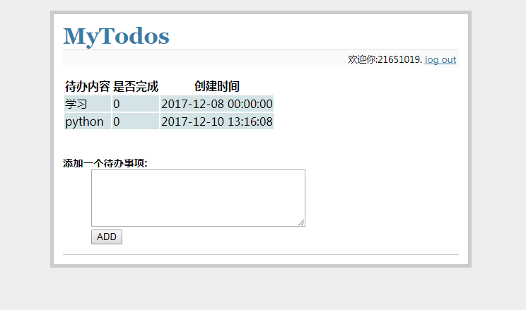

## 项目简介

python flask+mysql搭建的一个web项目，主要是一个记录个人待办事项的系统。基于此项目重点理解几个关于Sqlacmhey，MySQL的问题

---

## 知识点,遇到的问题

* flask框架简单使用 + Python 基础

* Sqlachemy,Flask-Sqlachemy

* [MySQL自身状态的认识](https://blog.csdn.net/qq_26437925/article/details/83782403)

* [数据库连接池和Sqlachemy](./db_pool.md)

* 几个数据库报错问题 => [重点理解分析](./code/README.md)

1. `TimeoutError: QueuePool limit of size 5 overflow 0 reached, connection timed out, timeout 30`

2. `too many connections`

3. `Lost Connection to MySQL server`

## jmeter测试[聚合报告]参数含义

* Label：每个请求的名称，比如HTTP请求等

* #Samples：发给服务器的请求数量

* Average：单个请求的平均响应时间。默认是单个Request的平均响应时间，当使用了Transaction Controller时，也可以以Transaction为单位显示平均响应时间

* Median：中位数，也就是50%用户的响应时间

* 90%Line：90%用户的响应时间

* 95%Line：95%用户的响应时间

* 99%Line：99%用户的响应时间

* Min：最小的响应时间

* Max：最大的响应时间

* Error%：错误率，本次测试中出现错误的请求的数量/请求的总数

* Throughput：吞吐量。默认情况下表示每秒完成的请求数，吞吐量=请求数/总时间

* Received KB/sec：每秒从服务器端接收到的数据量，即：收到的千字节每秒的吞吐量测试

* Sent KB/sec：每秒从客户端发送的请求的数量，即：发送的千字节每秒的吞吐量测试

参考：https://blog.csdn.net/automationwei/article/details/80734178

## 主要开发环境要求

* python 2.7

* flask,sqlalchemy,flask-salachmey(数据库orm)

* mysql （见test.sql文件）

## 功能说明

### 粗版

1. 用户直接登录，未加注册功能

2. 能够显示一个登录用户的所有待办事项

3. 能够添加待办事项，但是不能修改

### 加强

* 登录，注册功能

* 数据修改功能

* 界面美观

## 运行截图

## 参考

* Flask框架的学习指南之制作简单blog系统

作者： 茁壮的小草

地址： https://www.cnblogs.com/mysql-dba/p/6066861.html

* Flask-SQLAlchemy

http://flask-sqlalchemy.pocoo.org/2.3/

* 四个好看的CSS样式表格

作者：nightelve

地址：http://blog.csdn.net/nightelve/article/details/7957726/

* 思路来源

https://github.com/lalor/todolist

# Todo
