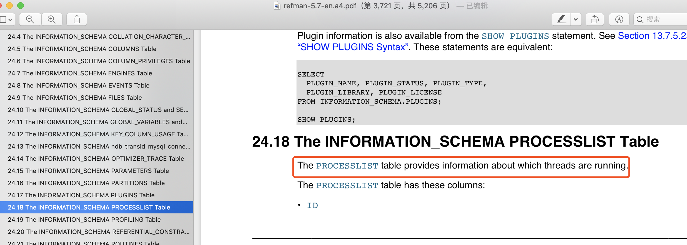
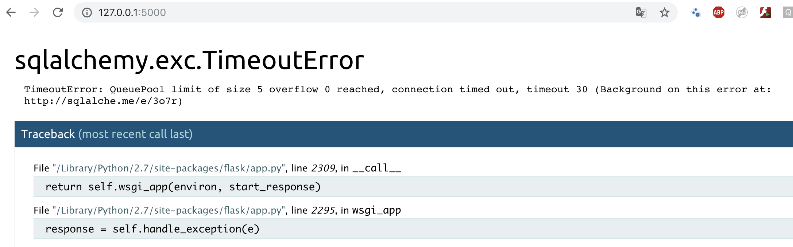
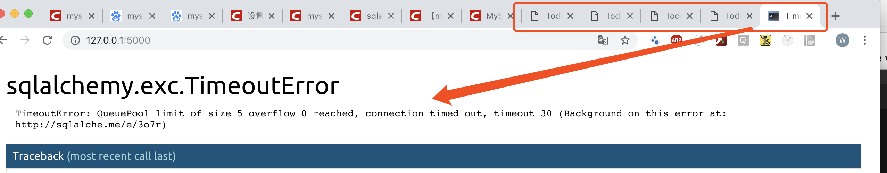
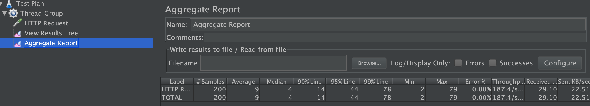
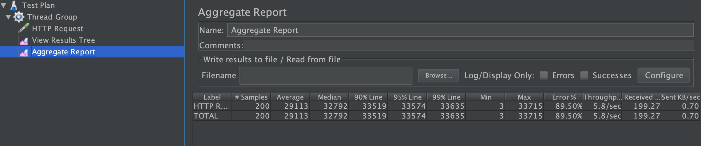
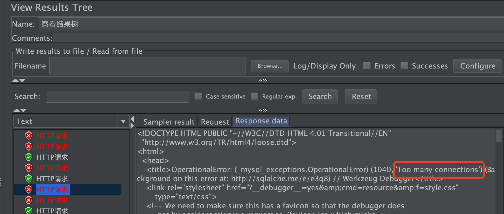

出现`TimeoutError: QueuePool limit of size 5 overflow 0 reached, connection timed out, timeout 30`报错，分析和解决如下

## 数据库的相关变量如下

```sql
mysql> show variables like '%timeout%';
+-----------------------------+----------+
| Variable_name               | Value    |
+-----------------------------+----------+
| connect_timeout             | 10       |
| delayed_insert_timeout      | 300      |
| innodb_flush_log_at_timeout | 1        |
| innodb_lock_wait_timeout    | 50       |
| innodb_rollback_on_timeout  | OFF      |
| interactive_timeout         | 28800    |
| lock_wait_timeout           | 31536000 |
| net_read_timeout            | 30       |
| net_write_timeout           | 60       |
| rpl_stop_slave_timeout      | 31536000 |
| slave_net_timeout           | 3600     |
| wait_timeout                | 28800    |
+-----------------------------+----------+
12 rows in set (0.00 sec)

mysql>
```

```sql
mysql> show variables like '%connect%';
+-----------------------------------------------+-----------------+
| Variable_name                                 | Value           |
+-----------------------------------------------+-----------------+
| character_set_connection                      | utf8            |
| collation_connection                          | utf8_general_ci |
| connect_timeout                               | 10              |
| disconnect_on_expired_password                | ON              |
| init_connect                                  |                 |
| max_connect_errors                            | 100             |
| max_connections                               | 151             |
| max_user_connections                          | 0               |
| performance_schema_session_connect_attrs_size | 512             |
+-----------------------------------------------+-----------------+
9 rows in set (0.00 sec)

mysql>
```

```sql
mysql> show status like 'Abort%';
+------------------+-------+
| Variable_name    | Value |
+------------------+-------+
| Aborted_clients  | 5     |
| Aborted_connects | 0     |
+------------------+-------+
2 rows in set (0.00 sec)

mysql>
```

## 查看连接MySQL的线程信息

```sql
mysql> show full processlist;
+----+------+-----------------+------+---------+-------+-------+-----------------------+
| Id | User | Host            | db   | Command | Time  | State | Info                  |
+----+------+-----------------+------+---------+-------+-------+-----------------------+
|  2 | root | localhost       | test | Query   |     0 | init  | show full processlist |
|  8 | root | localhost:59270 | test | Sleep   | 38068 |       | NULL                  |
|  9 | root | localhost:59272 | test | Sleep   | 37914 |       | NULL                  |
| 10 | root | localhost:59288 | test | Sleep   | 37914 |       | NULL                  |
| 11 | root | localhost:59289 | test | Sleep   |   708 |       | NULL                  |
| 12 | root | localhost:59290 | test | Sleep   |   650 |       | NULL                  |
+----+------+-----------------+------+---------+-------+-------+-----------------------+
6 rows in set (0.00 sec)

mysql>
```

查看MySQL官方文档


* ID

The connection identifier. This is the same type of value displayed in the `Id` column of the `SHOW PROCESSLIST` statement, the `PROCESSLIST_ID` column of the Performance Schema threads table, and returned by the `CONNECTION_ID()` function.

* USER

The MySQL user who issued the statement. A value of `system user` refers to a nonclient thread spawned by the server to handle tasks internally. This could be the I/O or SQL thread used on replication slaves or a delayed-row handler. For `system user`, there is no host specified in the `Host` column. `unauthenticated user` refers to a thread that has become associated with a client connection but for which authentication of the client user has not yet been done. `event_scheduler` refers to the thread that monitors scheduled events

* HOST

The host name of the client issuing the statement (except for `system user`, for which there is no host). The host name for TCP/IP connections is reported in `host_name:client_port` format to make it easier to determine which client is doing what.

* DB

The default database, if one is selected; otherwise `NULL`.

* COMMAND

The type of command the thread is executing

* TIME

The time in seconds that the thread has been in its current state. For a slave SQL thread, the value is the number of seconds between the timestamp of the last replicated event and the real time of the slave machine.

* STATE

An action, event, or state that indicates what the thread is doing.

* INFO

The statement the thread is executing, or `NULL` if it is not executing any statement. The statement might be the one sent to the server, or an innermost statement if the statement executes other statements. For example, if a `CALL` statement executes a stored procedure that is executing a `SELECT` statement, the `INFO` value shows the `SELECT` statement.

# 问题分析

前一天是正常的，过了一晚刷页面出现这个问题




首先代码写的时候`session`是没有`close`的, 并且连接池数量很小（<font color="red">故意这么做的</font>）

`wait_time`含义：交互式和非交互式链接的超时设置, 防止客户端长时间链接数据库,什么都不做处于sleep状态，强制关闭长时间的sleep连接。默认情况下该值为28800s(8小时)

原因分析：

```python
engine = create_engine('mysql://root:@127.0.0.1:3306/test',
                        max_overflow = 0,  # 超过连接池大小外最多创建的连接
                        pool_size = 5,  # 连接池大小
                        pool_timeout = 30,  # 池中没有线程最多等待的时间，否则报错
                        pool_recycle = -1,  # 多久之后对线程池中的线程进行一次连接的回收（重置）—— -1 永不回收
                        echo=True)
```

由于超过8小时处理sleep状态，session被关闭了，然后sqlachemy的连接数设置也已经连接满了,刷新页面由于session过期，然后就报错: ```TimeoutError: QueuePool limit of size 5 overflow 0 reached, connection timed out, timeout 30 (Background on this error at: http://sqlalche.me/e/3o7r)```

为了复现问题

```sql
set global wait_timeout=60;

mysql> show global variables like '%timeout%';
+-----------------------------+----------+
| Variable_name               | Value    |
+-----------------------------+----------+
| connect_timeout             | 10       |
| delayed_insert_timeout      | 300      |
| innodb_flush_log_at_timeout | 1        |
| innodb_lock_wait_timeout    | 50       |
| innodb_rollback_on_timeout  | OFF      |
| interactive_timeout         | 28800    |
| lock_wait_timeout           | 31536000 |
| net_read_timeout            | 30       |
| net_write_timeout           | 60       |
| rpl_stop_slave_timeout      | 31536000 |
| slave_net_timeout           | 3600     |
| wait_timeout                | 60       |
+-----------------------------+----------+
12 rows in set (0.00 sec)

mysql>
```

MySQL终端不断的`show full processlist;`查看，截取到如下

```sql
mysql> show full processlist;
+----+------+-----------------+------+---------+------+-------+-----------------------+
| Id | User | Host            | db   | Command | Time | State | Info                  |
+----+------+-----------------+------+---------+------+-------+-----------------------+
| 14 | root | localhost       | test | Query   |    0 | init  | show full processlist |
| 15 | root | localhost:62499 | test | Sleep   |   59 |       | NULL                  |
| 16 | root | localhost:62501 | test | Sleep   |   22 |       | NULL                  |
| 17 | root | localhost:62503 | test | Sleep   |   22 |       | NULL                  |
| 18 | root | localhost:62505 | test | Sleep   |   49 |       | NULL                  |
| 19 | root | localhost:62521 | test | Sleep   |   22 |       | NULL                  |
+----+------+-----------------+------+---------+------+-------+-----------------------+
6 rows in set (0.00 sec)

mysql> show full processlist;
+----+------+-----------------+------+---------+------+-------+-----------------------+
| Id | User | Host            | db   | Command | Time | State | Info                  |
+----+------+-----------------+------+---------+------+-------+-----------------------+
| 14 | root | localhost       | test | Query   |    0 | init  | show full processlist |
| 16 | root | localhost:62501 | test | Sleep   |   23 |       | NULL                  |
| 17 | root | localhost:62503 | test | Sleep   |   23 |       | NULL                  |
| 18 | root | localhost:62505 | test | Sleep   |   50 |       | NULL                  |
| 19 | root | localhost:62521 | test | Sleep   |   23 |       | NULL                  |
+----+------+-----------------+------+---------+------+-------+-----------------------+
5 rows in set (0.00 sec)
```

又出现了同样的报错



不断的这么刷页面玩，这种报错在每个页面都能出现，而且新开个页面也报错


正是由于session过期，但是服务仍然启动着，sqlachemy的pool_size是5，session过期不可用，但是仍然在池子中，虽然session由于没有引用会被垃圾回收，但这是不确定的，至少这里能复现了connect timeout问题。

## 进一步测试不关闭session的并发问题

```python
@app.route('/test1')
def test1():
    db_session = DB_Session()
    todos = db_session.query(Todo).all()
    db_session.close()
    return "test1"

@app.route('/test2')
def test2():
    db_session = DB_Session()
    todos = db_session.query(Todo).all()
    return "test2"
```

200个线程

* test1 测试并发



* test2 测试并发




所以`session`开了千万记得`close()`,`close()`,`close()`, 同时也应该把连接池的数量设置高一点，不然分配不到session


# max_connections(MySQL variables)

使用Sqlachemy的`NullPool`,

```python
engine = create_engine('mysql://root:@127.0.0.1:3306/test',poolclass=NullPool,echo=True)
```

在调用create_engine是指定连接池为NullPool, SQLAlchemy就会在执行session.close()后立刻断开数据库连接。当然，如果session对象被析构但是没有被调用session.close()，则数据库连接不会被断开，直到程序终止。

```sql
mysql> show global variables like '%connect%';
+-----------------------------------------------+-------------------+
| Variable_name                                 | Value             |
+-----------------------------------------------+-------------------+
| character_set_connection                      | latin1            |
| collation_connection                          | latin1_swedish_ci |
| connect_timeout                               | 10                |
| disconnect_on_expired_password                | ON                |
| init_connect                                  |                   |
| max_connect_errors                            | 100               |
| max_connections                               | 151               |
| max_user_connections                          | 0                 |
| performance_schema_session_connect_attrs_size | 512               |
+-----------------------------------------------+-------------------+
9 rows in set (0.00 sec)

mysql>
```

使用jmeter测试`500`个并发请求`/test1`接口

```python
@app.route('/test1')
def test1():
    db_session = DB_Session()
    todos = db_session.query(Todo).all()
    db_session.close()
    return "test1"
```

因为`max_connections`是150(151有个1是给root的),没有使用线程池，500个并发请求，同一时刻会有超过150个MySQL连接线程，这样就会报<font color='red'>too many connections</font>错误



# Todo
